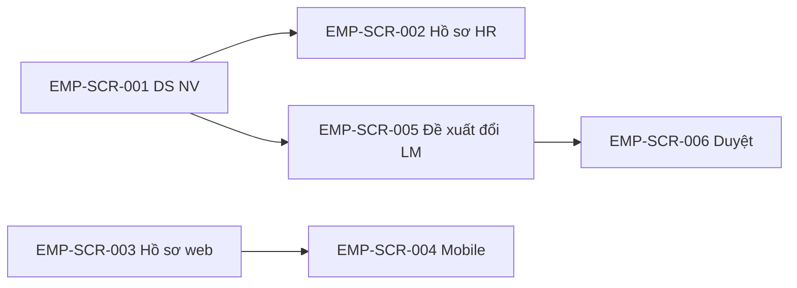

# DOC-19 — Prototype / Wireframe — Employee profile (EMP)

| Phiên bản | Ngày | Tác giả | Trạng thái |
|-----------|------|---------|------------|
| 0.1 | 2026-08-25 | Trịnh Yên (BA) | **Chốt khung** (DEC-REQ-029 · HTML hoãn) |

**Module:** employee-profile · **Tiên quyết:** DOC-04 **Chốt** (DEC-REQ-023) · DOC-05 **Chốt** (DEC-REQ-026).  
**Cổng:** DEC-REQ-029 **đã chốt khung** 2026-08-25. HTML MCP = nợ, không chặn SRS. Ban HR ☐. **Chưa** `02-baseline/`. **Không** tự SRS.

---

## 1. Phạm vi prototype

| Trace (BR/UC) | Màn hình / luồng | Mục tiêu |
|---------------|------------------|----------|
| EMP-UC-001 · EMP-BR-001…006, 010 | Tạo NV | Unique + org + HĐ; email/MST trống được |
| EMP-UC-002 · EMP-BR-001…006, 008 | Sửa hồ sơ HR | SoT; đổi LM không đường tắt |
| EMP-UC-003 · EMP-BR-009 | Self-service | Web = mobile; field HR-only khóa |
| EMP-UC-004 · EMP-BR-008, 011 | Đổi LM | Một bậc duyệt; không mở phiếu lương |
| EMP-UC-005 · EMP-BR-007 | Thâm niên | Công thức master, không hardcode năm |

## 2. Danh sách màn hình

| Screen ID | Tên | Actor | Trạng thái |
|-----------|-----|-------|------------|
| EMP-SCR-001 | Danh sách nhân viên | HR/C&B | **Chốt khung** |
| EMP-SCR-002 | Tạo / sửa hồ sơ (HR) | HR/C&B | **Chốt khung** |
| EMP-SCR-003 | Hồ sơ của tôi (web) | NV | **Chốt khung** |
| EMP-SCR-004 | Hồ sơ của tôi (mobile) | NV | **Chốt khung** — cùng rule 003 |
| EMP-SCR-005 | Đề xuất đổi Line Manager | HR/C&B | **Chốt khung** |
| EMP-SCR-006 | Duyệt đổi Line Manager | Người duyệt IAM | **Chốt khung** |

Không màn phiếu lương. Không màn ATS. Field hồ sơ **không** list cứng (master).

## 3. Wireframe / mockup

> TBD: HTML MCP. Mô tả tạm:

- **EMP-SCR-001:** DS NV (MNV, tên, đơn vị, trạng thái HĐ) · [Tạo] [Mở hồ sơ] — ẩn với NV thường (trừ IAM). Không cột lương.
- **EMP-SCR-002:** Form HR: định danh + org (dropdown catalog hiệu lực) + HĐ (loại/ngày/TV–chính thức). Cảnh báo thiếu HĐ. Lỗi trùng MNV/CCCD/email/MST. **Không** widget đổi LM (→ SCR-005). Thâm niên read-only theo master.
- **EMP-SCR-003:** Chỉ hồ sơ user đăng nhập. Field được sửa = IAM/master; MNV/CCCD/… read-only. Không link hồ sơ người khác.
- **EMP-SCR-004:** Cùng field/validation 003; không nới quyền.
- **EMP-SCR-005:** Chọn NV + LM mới · [Gửi duyệt] — **chưa** ghi LM. Không checkbox “áp quyền lương”.
- **EMP-SCR-006:** Hàng chờ một bậc · [Duyệt] [Từ chối]. Sau duyệt: LM mới; **không** nút/xem phiếu lương cấp dưới.

## 4. Luồng điều hướng

NV vào thẳng SCR-003/004 (IAM), không qua SCR-001.

## 5. Ghi chú & câu hỏi mở

- Catalog field / tái tuyển CCCD: master, không hardcode UI.
- Nhiều bậc C1/C2 đổi LM: ngoài MVP (DOC-05).
- HTML MCP: nợ.

## 6. Cổng chốt

- [x] Người duyệt prototype (khung text/mermaid) → **DEC-REQ-029** → mở **DOC-06 SRS**.
- HTML MCP: **nợ** — không chặn SRS sau khi chốt khung.
