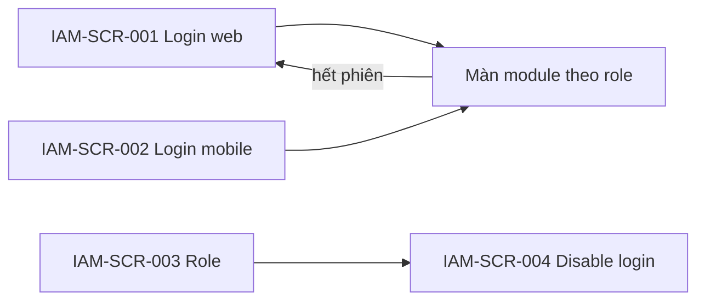

# DOC-19 — Prototype / Wireframe — Identity (IAM)

| Phiên bản | Ngày | Tác giả | Trạng thái |
|-----------|------|---------|------------|
| 0.1 | 2026-08-26 | Trịnh Yên (BA) | **Chốt khung** (DEC-REQ-045 · HTML hoãn) |

**Module:** identity · **Tiên quyết:** DOC-04 **Chốt** v0.2 (DEC-REQ-041) · DOC-05 **Chốt** v0.2 (DEC-REQ-043).  
**Cổng:** DEC-REQ-045 **đã chốt khung** 2026-08-26. HTML MCP = nợ, không chặn SRS. Ban HR ☐. **Chưa** `02-baseline/`. **Không** tự SRS.  
**Không màn:** khóa Git/CRM (LIF); CRM bán hàng; SSO/MFA pixel (DOC-08).

---

## 1. Phạm vi prototype

| Trace (BR/UC) | Màn hình / luồng | Mục tiêu |
|---------------|------------------|----------|
| IAM-UC-001 · IAM-BR-001, 002, 017 | Login web + mobile | Cùng identity; hết phiên → login lại |
| IAM-UC-002 · IAM-BR-003, 013, 014 | Gán role | HR/IT; NV/LM không vào |
| IAM-UC-003 · IAM-BR-004…008 | 403 | Không màn riêng — hành vi trên màn PAY/TIM/EMP |
| IAM-UC-004 · IAM-BR-010 | Disable login | IT; **không** nút khóa Git |
| IAM-UC-005 · IAM-BR-012 | CRM sales | **Không** nút / không màn |

## 2. Danh sách màn hình

| Screen ID | Tên | Actor | Trạng thái |
|-----------|-----|-------|------------|
| IAM-SCR-001 | Đăng nhập (web) | Mọi role | **Chốt khung** |
| IAM-SCR-002 | Đăng nhập (mobile) | Mọi role | **Chốt khung** — cùng rule 001 |
| IAM-SCR-003 | Quản trị role | HR / IT | **Chốt khung** |
| IAM-SCR-004 | Vô hiệu login | IT | **Chốt khung** |

Không màn Git. Không màn CRM sales. 403 = trạng thái trên màn module khác.

## 3. Wireframe / mockup

> TBD: HTML MCP. Mô tả tạm:

- **IAM-SCR-001:** Form đăng nhập · lỗi 401 (sai MK / hết phiên / TK vô hiệu). Không “vào không cần login”. Cơ chế field MK = DOC-08.
- **IAM-SCR-002:** Cùng field/validation 001; không nới role.
- **IAM-SCR-003:** DS user (MNV, role hiện tại) · [Gán] [Gỡ] dropdown 5 role MVP + permission master. Ẩn với NV/LM. **Không** checkbox “kèm quyền lương” khi gán LM.
- **IAM-SCR-004:** Chọn user · [Vô hiệu login] · **không** [Khóa Git] / [Khóa CRM]. HR vào đây: 403 hoặc không menu (trừ catalog IT).

Màn PAY phiếu / TIM chốt / EMP DS: NV/LM không thấy menu (IAM-UC-003) — không proto thêm trên IAM.

## 4. Luồng điều hướng

NV/LM không có đường vào SCR-003/004.

## 5. Ghi chú & câu hỏi mở

- 5 role MVP: NV / LM / HR / IT / PGD — PGD không mặc định lương Cty.
- HTML MCP: nợ.
- SSO/MFA: DOC-08.

## 6. Cổng chốt

- [x] Người duyệt prototype (khung text/mermaid) → **DEC-REQ-045** → mở **DOC-06 SRS**.
- HTML MCP: **nợ** — không chặn SRS sau khi chốt khung.
