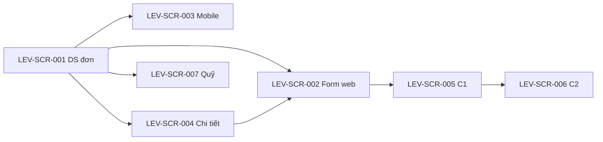

# DOC-19 — Prototype / Wireframe — Leave (LEV)

| Phiên bản | Ngày | Tác giả | Trạng thái |
|-----------|------|---------|------------|
| 0.1 | 2026-08-24 | Dư Hùng (BA) | **Chốt khung** (DEC-REQ-006 · HTML hoãn) |

**Cổng:** DEC-REQ-006 **đã chốt khung** 2026-08-24 (chọn A). HTML MCP = nợ, không chặn SRS.

---

## 1. Phạm vi prototype

| Trace (BR/UC) | Màn hình / luồng | Mục tiêu |
|---------------|------------------|----------|
| LEV-UC-001 · LEV-BR-001…008 | Form nộp đơn | NV đăng ký phép |
| LEV-UC-002 | Inbox C1 | LM duyệt/từ chối |
| LEV-UC-003 · LEV-BR-006, 008 | Inbox C2 | HR duyệt chính thức / đột xuất |
| LEV-UC-004 | Chi tiết đơn | NV hủy trước C2 |
| LEV-UC-005 | Quỹ phép | NV xem quỹ mình |
| LEV-UC-006 | Catalog | HR trần loại (tuỳ chọn) |

## 2. Danh sách màn hình

| Screen ID | Tên | Actor | Trạng thái |
|-----------|-----|-------|------------|
| LEV-SCR-001 | Danh sách đơn của tôi | NV | **Chốt khung** |
| LEV-SCR-002 | Form nộp / sửa đơn (web) | NV | **Chốt khung** |
| LEV-SCR-003 | Form nộp đơn (mobile) | NV | **Chốt khung** — cùng field 002 |
| LEV-SCR-004 | Chi tiết đơn + hủy | NV | **Chốt khung** |
| LEV-SCR-005 | Inbox duyệt C1 | LM | **Chốt khung** |
| LEV-SCR-006 | Inbox duyệt C2 | HR | **Chốt khung** |
| LEV-SCR-007 | Quỹ phép | NV | **Chốt khung** |
| LEV-SCR-008 | Cấu hình loại phép / trần | HR | **Chốt khung** |

## 3. Wireframe / mockup

> TBD: HTML MCP. Mô tả tạm:

- **LEV-SCR-002:** Loại phép · Từ–Đến · Sáng/Chiều/Cả ngày · Lý do · Bàn giao · Upload mẫu Cty (ốm) · cờ Nghỉ đột xuất · Submit. Cảnh báo: overlap, quỹ, 3 NLĐ, sai mẫu.
- **LEV-SCR-003:** Cùng field; không nới rule.
- **LEV-SCR-005:** [Phê duyệt] [Từ chối + lý do]. Đơn đột xuất: ghi chú “không trừ quỹ ở C1”.
- **LEV-SCR-006:** [Duyệt chính thức] [Từ chối]. Ẩn nếu C1 chưa duyệt.

## 4. Luồng điều hướng

## 5. Ghi chú & câu hỏi mở

- OQ-REQ-010: không có nút hủy hộ cho LM/HR trên SCR-005/006 (MVP).
- Mẫu file Cty: upload + kiểm tra theo quy định kỹ thuật TBD (mime) khi có MCP/IT.

## 6. Cổng chốt

- [x] Người duyệt prototype (khung text/mermaid) → **DEC-REQ-006** → mở **DOC-06 SRS**.
- HTML MCP: **nợ** — không chặn SRS.
