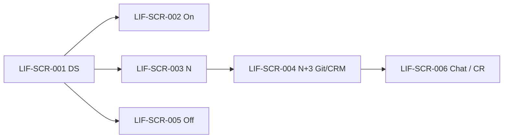

# DOC-19 — Prototype / Wireframe — Lifecycle (LIF)

| Phiên bản | Ngày | Tác giả | Trạng thái |
|-----------|------|---------|------------|
| 0.1 | 2026-08-25 | Trịnh Yên (BA) | **Chốt khung** (DEC-REQ-030 · HTML hoãn) |

**Module:** lifecycle · **Tiên quyết:** DOC-04 **Chốt** (DEC-REQ-024) · DOC-05 **Chốt** (DEC-REQ-027).  
**Cổng:** DEC-REQ-030 **đã chốt khung** 2026-08-25. HTML MCP = nợ, không chặn SRS. Ban HR ☐. **Chưa** `02-baseline/`. **Không** tự SRS.  
**Không màn:** notify CRM bán hàng; khóa lương PAY; e-sign HĐLĐ.

---

## 1. Phạm vi prototype

| Trace (BR/UC) | Màn hình / luồng | Mục tiêu |
|---------------|------------------|----------|
| LIF-UC-001 · LIF-BR-005, 007 | Onboarding | Checklist động + trạng thái đã cấp email/Git/CRM SP/chat |
| LIF-UC-002 · LIF-BR-001, 009 | Xác nhận N | Ngày LV cuối; không ngày ký đơn |
| LIF-UC-003 · LIF-BR-002…004, 008 | N+3 khóa | Job/IT; HR không SSH Git |
| LIF-UC-004 · LIF-BR-006 | Off checklist | Tick master; chặn đóng thiếu Must |
| LIF-UC-005 · LIF-BR-011, 004 | Chat / CR | Mốc chat ≠ mặc định Git; khóa sớm chỉ CR |

## 2. Danh sách màn hình

| Screen ID | Tên | Actor | Trạng thái |
|-----------|-----|-------|------------|
| LIF-SCR-001 | Danh sách on / off | HR/C&B | **Chốt khung** |
| LIF-SCR-002 | Onboarding: checklist + cấp TK | HR + IT | **Chốt khung** |
| LIF-SCR-003 | Xác nhận ngày LV cuối (N) | HR/C&B | **Chốt khung** |
| LIF-SCR-004 | Trạng thái khóa Git / CRM SP | IT (HR xem read-only) | **Chốt khung** |
| LIF-SCR-005 | Offboarding checklist | HR (+ IT theo mục) | **Chốt khung** |
| LIF-SCR-006 | Khóa chat / CR an ninh | IT | **Chốt khung** |

Tick list **không** tên cứng (master). Không màn pipeline sales.

## 3. Wireframe / mockup

> TBD: HTML MCP. Mô tả tạm:

- **LIF-SCR-001:** DS hồ sơ on/off (NV, trạng thái, N nếu có, N+3 dự kiến) · [Mở on] [Mở off]. NV không xác nhận N.
- **LIF-SCR-002:** Checklist on (cột mục từ master) · khối trạng thái cấp: email / Git / CRM SP / chat (IT đánh dấu đã cấp). [Đóng on] disabled nếu thiếu tick Must. **Không** hẹn cấp Git = N+3.
- **LIF-SCR-003:** Field **Ngày làm việc cuối** · nhãn cấm nhầm “ngày ký đơn”. Chỉ HR lưu = xác nhận. NV xem read-only / 403 ghi.
- **LIF-SCR-004:** N, N+3 (**ngày lịch** nháp), trạng thái Git / CRM SP (Mở / Đã khóa). HR: không nút SSH/khóa Git — [Tạo ticket IT] nếu cần. IT/job: [Khóa] chỉ khi ≥ N+3 trừ SCR-006. Không nút “gửi CRM sales”.
- **LIF-SCR-005:** Checklist off (master) · [Đóng off] disabled nếu thiếu Must. Không thay N+3.
- **LIF-SCR-006:** Khóa chat theo mốc master · [CR an ninh] ghi lý do nếu khóa Git/CRM **trước** N+3.

## 4. Luồng điều hướng

Job N+3 chạy nền; SCR-004 là SoT hiển thị.

## 5. Ghi chú & câu hỏi mở

- N+3 = 3 **ngày lịch** (nháp) — chưa vs ngày công chuẩn.
- Mục checklist / mốc chat: master.
- HTML MCP: nợ.

## 6. Cổng chốt

- [x] Người duyệt prototype (khung text/mermaid) → **DEC-REQ-030** → mở **DOC-06 SRS**.
- HTML MCP: **nợ** — không chặn SRS sau khi chốt khung.
