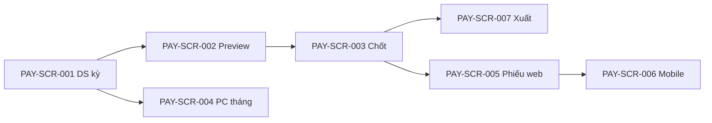

# DOC-19 — Prototype / Wireframe — Payroll (PAY)

| Phiên bản | Ngày | Tác giả | Trạng thái |
|-----------|------|---------|------------|
| 0.1 | 2026-08-25 | Trịnh Yên (BA) | **Chốt khung** (DEC-REQ-013 · HTML hoãn) |

**Module:** payroll · **Tiên quyết:** DOC-04 **Chốt** (DEC-REQ-011) · DOC-05 **Chốt** (DEC-REQ-012).  
**Cổng:** DEC-REQ-013 **đã chốt khung** 2026-08-25. HTML MCP = nợ, không chặn SRS. Ban HR ☐. **Chưa** `02-baseline/`.

---

## 1. Phạm vi prototype

| Trace (BR/UC) | Màn hình / luồng | Mục tiêu |
|---------------|------------------|----------|
| PAY-UC-001 · PAY-BR-001…006, 009, 011 | Tính / preview kỳ | HR xem N_tính, 85%, OT, PC, BH/TNCN — không sửa công |
| PAY-UC-002 · PAY-BR-002, 008, 010 | Chốt kỳ | HR khóa kỳ khi trần ngày công OK |
| PAY-UC-003 · PAY-BR-005 | Nhập PC tháng | HR ghi kênh 2 theo master |
| PAY-UC-004 · PAY-BR-007, 012 | Phiếu của tôi | NV xem phiếu mình (web + mobile) |
| PAY-UC-005 · PAY-BR-007, 010 | Xuất hàng loạt | HR PDF/email đúng người |

## 2. Danh sách màn hình

| Screen ID | Tên | Actor | Trạng thái |
|-----------|-----|-------|------------|
| PAY-SCR-001 | Danh sách kỳ lương | HR/C&B | **Chốt khung** |
| PAY-SCR-002 | Tính / preview kỳ | HR/C&B | **Chốt khung** |
| PAY-SCR-003 | Xác nhận chốt kỳ | HR/C&B | **Chốt khung** |
| PAY-SCR-004 | Nhập PC/thưởng tháng | HR/C&B | **Chốt khung** |
| PAY-SCR-005 | Phiếu lương của tôi (web) | NV | **Chốt khung** |
| PAY-SCR-006 | Phiếu lương của tôi (mobile) | NV | **Chốt khung** — cùng field 005 |
| PAY-SCR-007 | Xuất phiếu hàng loạt | HR/C&B | **Chốt khung** |

Không màn hình lương cho LM (PAY-ACT-002).

## 3. Wireframe / mockup

> TBD: HTML MCP. Mô tả tạm:

- **PAY-SCR-001:** DS kỳ (Draft / Chốt) · [Tính lương] [PC tháng] [Xuất] — ẩn với NV/LM.
- **PAY-SCR-002:** Chọn kỳ · bảng preview từng NV: N_thực, N_KHL, N_tính, hệ số TV, OT, PC HĐ, PC tháng, BH, TNCN tạm, thực lĩnh. **Không** ô sửa ngày công/OT/phép. Cảnh báo: TIM chưa chốt; N_tính > chuẩn; A-001. [Chốt kỳ] → SCR-003.
- **PAY-SCR-003:** Tóm tắt số NV / tổng quỹ · checkbox xác nhận · [Chốt]. Chặn nếu trần ngày công hoặc TIM bỏ chốt.
- **PAY-SCR-004:** Kỳ · NV · mã **dropdown master kỳ** · số tiền · [Lưu]. Lỗi nếu mã không thuộc master.
- **PAY-SCR-005:** Chỉ phiếu kỳ **đã chốt** của user đăng nhập: cùng nhóm dòng preview (read-only). Không link “cấp dưới”.
- **PAY-SCR-006:** Cùng field 005; không nới quyền.
- **PAY-SCR-007:** Chọn kỳ đã chốt · PDF và/hoặc email · không CC LM · không gửi nhầm người.

## 4. Luồng điều hướng

NV vào thẳng SCR-005/006 (IAM), không qua SCR-001.

## 5. Ghi chú & câu hỏi mở

- Hủy chốt kỳ: **không** nút trên SCR-003 (ngoài MVP, DOC-05).
- Làm tròn / UAT 0 đồng: không field UI — DOC-07.
- Danh mục mã PC: không hardcode trên wireframe (DEC-DIS-014).
- HTML MCP: nợ.

## 6. Cổng chốt

- [x] Người duyệt prototype (khung text/mermaid) → **DEC-REQ-013** → mở **DOC-06 SRS**.
- HTML MCP: **nợ** — không chặn SRS.
