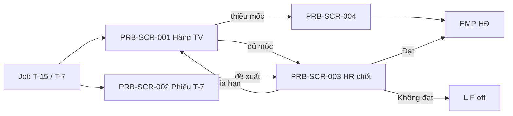

# DOC-19 — Prototype / Wireframe — Probation (PRB)

| Phiên bản | Ngày | Tác giả | Trạng thái |
|-----------|------|---------|------------|
| 0.1 | 2026-08-26 | Trịnh Yên (BA) | **Chốt khung** (DEC-REQ-055 · HTML hoãn) |

**Module:** probation · **Tiên quyết:** DOC-04 **Chốt** (DEC-REQ-051) · DOC-05 **Chốt** (DEC-REQ-053).  
**Cổng:** DEC-REQ-055 **đã chốt khung** 2026-08-26. HTML MCP = nợ, không chặn SRS. Ban HR ☐. **Chưa** `02-baseline/`. **Không** tự SRS.  
**Không màn:** tính 85% lương (PAY); ATS; CRM bán hàng; list tiêu chí cứng; e-sign HĐ; SN/lễ (EVT).

---

## 1. Phạm vi prototype

| Trace (BR/UC) | Màn hình / luồng | Mục tiêu |
|---------------|------------------|----------|
| PRB-UC-001 · PRB-BR-002, 008, 010, 011 | Inbox / DS TV T-15 | Nhắc đúng hạn; 0 sót; không nút CRM sales |
| PRB-UC-002 · PRB-BR-003, 009, 012 | Phiếu T-7 (LM) | Đề xuất 3 mã; phiếu động; **không** nút chốt SoT |
| PRB-UC-003 · PRB-BR-004…007, 009 | HR chốt kết quả | 3 mã; gia hạn = master; Đạt/Không đạt → EMP/LIF |
| PRB-UC-004 · PRB-BR-001 | Thiếu mốc | Cảnh báo; sửa trên EMP; không field “bịa ngày” trên PRB |

## 2. Danh sách màn hình

| Screen ID | Tên | Actor | Trạng thái |
|-----------|-----|-------|------------|
| PRB-SCR-001 | Hàng TV / cảnh báo T-15 | HR (LM xem team nếu catalog) | **Chốt khung** |
| PRB-SCR-002 | Phiếu đánh giá T-7 | LM (không LM → HR) | **Chốt khung** |
| PRB-SCR-003 | Chốt kết quả TV | HR | **Chốt khung** |
| PRB-SCR-004 | Thiếu mốc HĐ | HR | **Chốt khung** |

Không màn CRM sales. Không màn PAY 85%. Không màn LIF checklist (LIF DOC-19).

## 3. Wireframe / mockup

> TBD: HTML MCP. Mô tả tạm:

- **PRB-SCR-001:** Bảng NV đang TV (MNV, tên, KT_TV từ EMP, trạng thái T-15 đã/chưa nhắc). Badge T-15. **Không** [Gửi CRM sales]. **Không** cột tự bịa KT. Click → 003 hoặc 004 nếu thiếu mốc.
- **PRB-SCR-002:** Task T-7 · vùng tiêu chí **động** (master, không list cứng) · radio đề xuất {Đạt, Gia hạn, Không đạt} · [Lưu đề xuất]. **Không** nút [Chốt chính thức] / [Chuyển HĐ]. NV vào: 403 hoặc không menu.
- **PRB-SCR-003:** Tóm tắt đề xuất LM (nếu có) · HR chọn 3 mã · nếu Gia hạn: dropdown thời lượng **master** (không ô “số tháng tự do”) · [Chốt]. Đạt: copy “EMP chuyển chính thức — lương theo HĐ/PAY”. Không đạt: copy “mở off LIF”. NV/LM: 403 trên [Chốt].
- **PRB-SCR-004:** Cảnh báo thiếu BĐ/KT TV · [Mở hồ sơ HĐ EMP] · **không** date picker KT ảo trên PRB.

Kênh nhắc T-15/T-7: toast/inbox HRM + email/app — không proto vendor.

## 4. Luồng điều hướng

NV không có đường vào SCR-003 [Chốt]. LM không có [Chốt].

## 5. Ghi chú & câu hỏi mở

- T-15/T-7 = **ngày lịch** (kèm BR/UC).
- Không LM → task T-7 trên SCR-002 mở cho HR (DEC-REQ-053).
- Không date picker KT ảo trên PRB — sửa mốc trên EMP (kèm chốt).

## 6. Cổng chốt

- [x] Người duyệt prototype (khung text/mermaid) → **DEC-REQ-055** → mở **DOC-06 SRS**.
- HTML MCP: **nợ** — không chặn SRS sau khi chốt khung.

## 7. Phê duyệt

| Vai trò | Họ tên | Ngày | Baseline |
|---------|--------|------|----------|
| Sponsor **(A)** | Mr. Dư Hùng, PGD | 2026-08-26 | ☑ Chốt khung v0.1 — DEC-REQ-055 |
| BA (R) | Trịnh Yên | 2026-08-26 | Soạn Draft khung |
| Business Owner | Ban HR | | ☐ Nợ |
