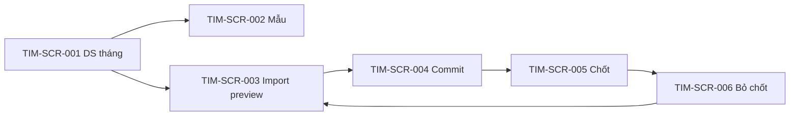

# DOC-19 — Prototype / Wireframe — Timekeeping (TIM)

| Phiên bản | Ngày | Tác giả | Trạng thái |
|-----------|------|---------|------------|
| 0.1 | 2026-08-25 | Trịnh Yên (BA) | **Chốt khung** (DEC-REQ-019 · HTML hoãn) |

**Module:** timekeeping · **Tiên quyết:** DOC-04 **Chốt** (DEC-REQ-017) · DOC-05 **Chốt** (DEC-REQ-018).  
**Cổng:** DEC-REQ-019 khung **Chốt**. HTML TIM: file local (DEC-REQ-060) — **không** MCP ngoài. Ban HR ☐. **Chưa** `02-baseline/`.

---

## 1. Phạm vi prototype

| Trace (BR/UC) | Màn hình / luồng | Mục tiêu |
|---------------|------------------|----------|
| TIM-UC-001 · TIM-BR-001, 002 | Công bố mẫu | Một version Excel hiệu lực; cột master |
| TIM-UC-002 · TIM-BR-003, 004, 009, 012 | Import + preview | Đúng version; hiện lỗi dòng; chưa ghi |
| TIM-UC-003 · TIM-BR-004 | Commit | Ghi khi hết lỗi Must |
| TIM-UC-004 · TIM-BR-005…008 | Chốt tháng | OT + phép Đã duyệt + N_thực gồm phép hưởng |
| TIM-UC-005 · TIM-BR-011 | Bỏ chốt | Import lại; không mở kỳ PAY đã chốt |

## 2. Danh sách màn hình

| Screen ID | Tên | Actor | Trạng thái |
|-----------|-----|-------|------------|
| TIM-SCR-001 | Danh sách tháng công | HR/C&B | **Chốt khung** |
| TIM-SCR-002 | Công bố version mẫu | HR/C&B | **Chốt khung** |
| TIM-SCR-003 | Import + preview lỗi | HR/C&B | **Chốt khung** |
| TIM-SCR-004 | Xác nhận ghi (commit) | HR/C&B | **Chốt khung** |
| TIM-SCR-005 | Xác nhận chốt tháng | HR/C&B | **Chốt khung** |
| TIM-SCR-006 | Bỏ chốt tháng | HR/C&B | **Chốt khung** |

Không màn hình cho NV/LM. Không màn máy CC.

## 3. Wireframe / mockup

**HTML (nháp click-through):** [`prototype/tim-mockup.html`](prototype/tim-mockup.html) — TIM-SCR-001…006. Wireframe, không pixel production. MCP ngoài vẫn hoãn.

- **TIM-SCR-001:** DS tháng (Draft / Chốt) · [Mẫu] [Import] — ẩn NV/LM.
- **TIM-SCR-002:** Version đang hiệu lực · [Công bố mẫu mới] · **không** list tên cột cứng (master). Cấm hai mẫu song song.
- **TIM-SCR-003:** Chọn tháng + file · preview bảng: OK / lỗi Must (sai version, thiếu NV, OT không loại). **Không** ô sửa công kiểu PAY. [Ghi] disabled nếu còn lỗi Must.
- **TIM-SCR-004:** Tóm tắt số dòng OK · [Ghi bảng công]. Chặn nếu còn lỗi.
- **TIM-SCR-005:** Checkbox merge phép Đã duyệt + N_thực gồm phép hưởng · [Chốt]. Cảnh báo OT thiếu loại.
- **TIM-SCR-006:** [Bỏ chốt] · disable nếu kỳ PAY đã chốt · không form sửa ô trên PAY.

## 4. Luồng điều hướng

## 5. Ghi chú & câu hỏi mở

- Checksum / mã version trên file: TBD DOC-06.
- Xem công NV: không màn (BRQ-006).
- Cột Excel: không hardcode (DEC-DIS-014).
- HTML MCP (generator ngoài): vẫn nợ pack.
- HTML TIM local: [`prototype/tim-mockup.html`](prototype/tim-mockup.html) (DEC-REQ-060).

## 6. Cổng chốt

- [x] Người duyệt prototype (khung text/mermaid) → **DEC-REQ-019** → mở **DOC-06 SRS**.
- HTML TIM local: **đã có** (DEC-REQ-060). MCP ngoài: **nợ** — không chặn SRS.
